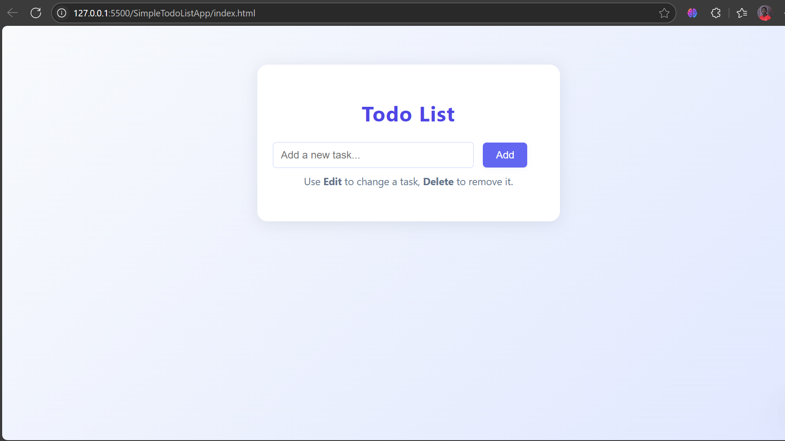
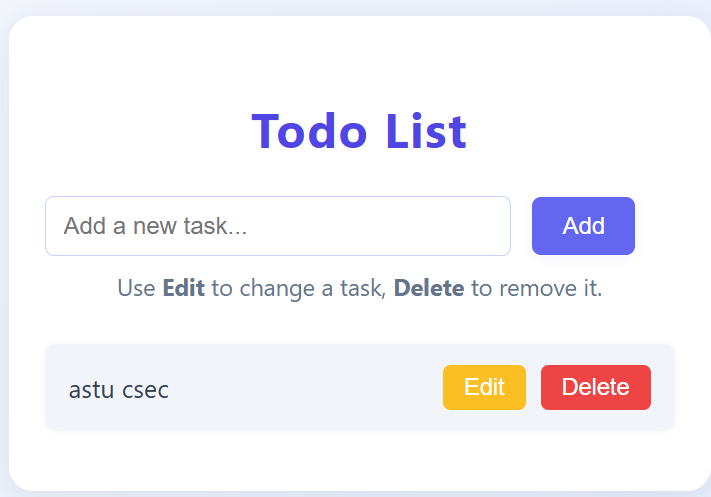

# Simple Todo List App

A clean and easy-to-use Todo List application for managing your daily tasks. Built with HTML, CSS, and JavaScript.

## How to Use
1. Open `index.html` in your browser.
2. Type a task and click Add.
3. Click Edit to change a task, or Delete to remove it.

No installation needed!

## Screenshots

### Main Page

*A modern, minimal interface where you can add new tasks to your list.*

### Edit or Delete a Task

*Easily update your tasks using the Edit button, or remove them with the Delete button. The interface is intuitive and user-friendly.*

---

This project demonstrates best practices in basic web development and user experience design. 