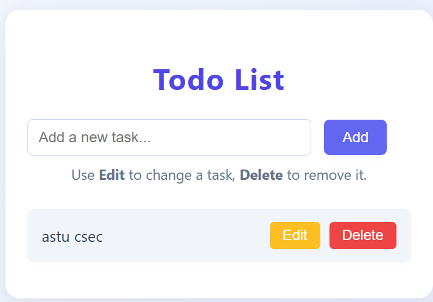

# Simple Todo List App

A simple Todo List you can use in your web browser.

## How to Use
1. Open `index.html` in your browser.
2. Type a task and click Add.
3. Click Edit to change a task, or Delete to remove it.

No installation needed!

## Screenshots

### Main Page

*Add new tasks here.*

### Edit or Delete a Task

*Edit or delete your tasks easily.*

---

Made with HTML, CSS, and JavaScript. 